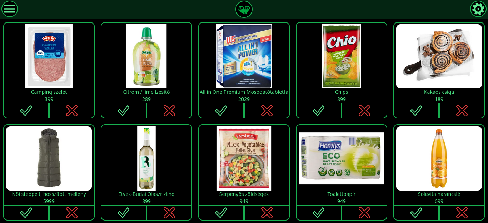
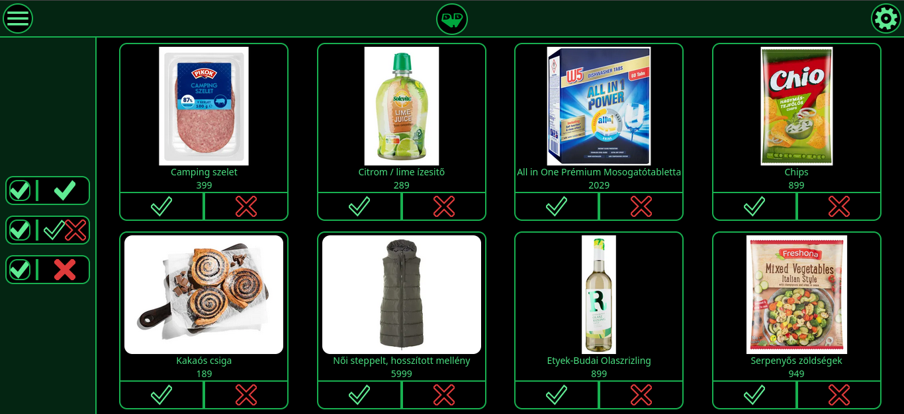
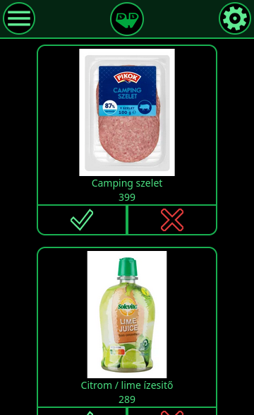

# Discount-Discovery

A selfhost app to easyly browse and manage several stores discounts comfortably.

The project is in early stage and only have parsers for some Hungarian stores.

# Screenshots






# Install


### Docker Compose

Start Discount-Discovery in detached mode (running in the background):

```bash
docker compose up -d
```


### Docker CLI

Deploy Discount-Discovery:

```bash
docker pull ddanii/discount-discovery
docker run -d --name discount-discovery -p 3000:3000 ddanii/discount-discovery --mount type=bind,src=../config,dst=/config
```


## Roadmap

[]countries
[]product details with popup 
[]past, future and more product sorting
[]shop sources from settings
[]user management 

