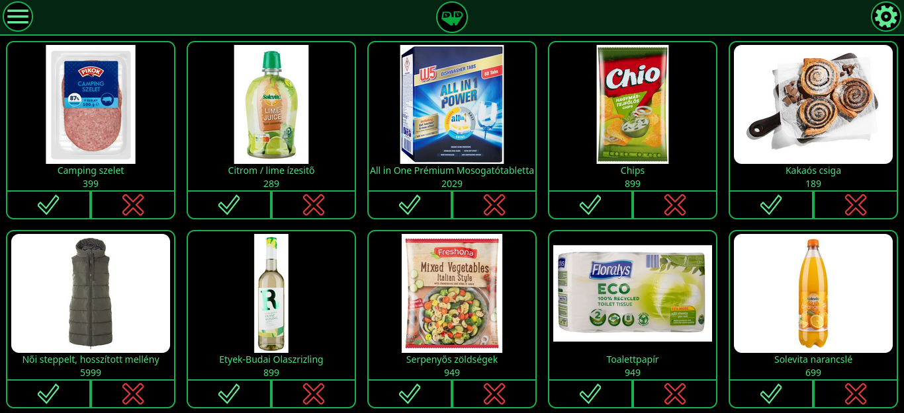
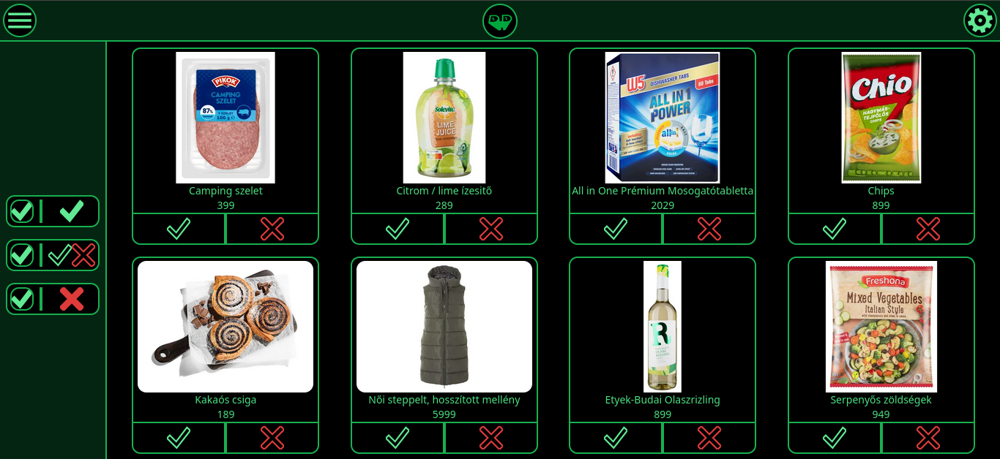
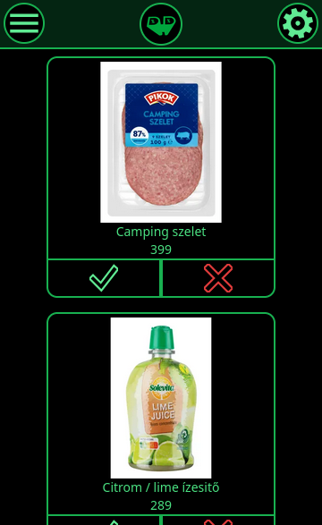
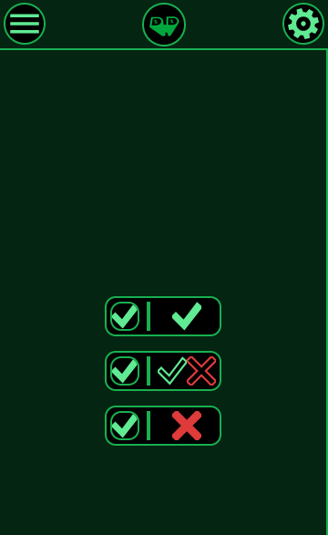

# Discount-Discovery

A selfhost app to easyly browse and manage several stores discounts comfortably.

The project is in early stage and only have parsers for some Hungarian stores.


# Screenshots






# Install

It requires a running CouchDB instance.

And the following environment variables:

```
COUCHDB_USER
COUCHDB_PASSWORD
DISCOUT_DISCOVERY_DB_URL 

#optionals:
DISCOUT_DISCOVERY_DB_SETUP //default false
```

After launching the app you have to log in to CouchDB in settings.

### Docker Compose

Set password and COUCHDB_USER and COUCHDB_PASSWORD in the docker-compose.yml file

Start Discount-Discovery in detached mode (running in the background):

```bash
docker compose up -d
```


## Roadmap

- [ ] countries
- [x] product details with popup 
- [ ] past, future and more product sorting
- [ ] shop sources from settings
- [ ] user management
- [x] offline first
- [ ] data syncronication indicator
- [ ] merged view

